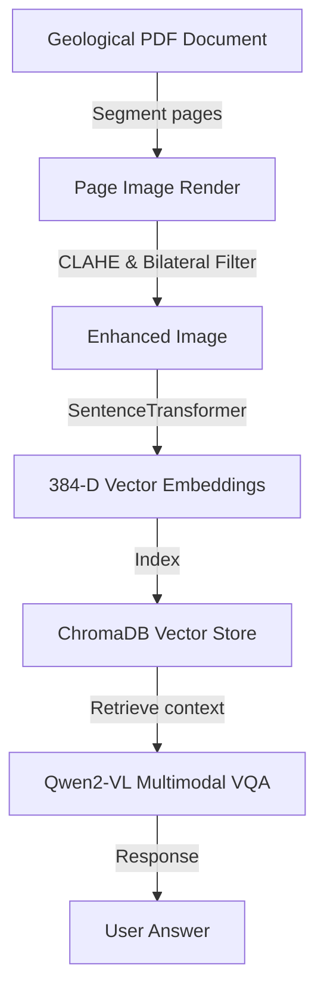

# 🗂️ Multi-Modal Geological RAG System (Telesto)
   

## 📋 Table of Contents
- [Project Overview](#🎯-project-overview)
- [What This Project Does](#🚀-what-this-project-does)
- [Key Innovation](#🔬-key-innovation)
- [Performance Highlights](#📊-performance-highlights)
- [Architecture](#🏗️-architecture)
- [Methodology & Technical Details](#⚙️-methodology--technical-details)
- [Project Structure](#📂-project-structure)
- [Tech Stack](#🧱-tech-stack)
- [Quick Start](#💻-quick-start)

---

## 🎯 Project Overview
Advanced geological data extraction tool combining PyTorch, Qwen2-VL vision-language model, and ChromaDB vector store. Indexes logs and stratigraphic maps using 384-dimensional SentenceTransformer embeddings across 4 collections.

---

## 🚀 What This Project Does
* **The Challenge:** Geological data sheets contain dense tables, graphical stratigraphic logs, and map plots, which standard text-only RAG systems fail to parse or index.
* **Our Solution:** A multi-modal RAG system using vision-language models (Qwen2-VL) to extract features from charts and index them in vector collections.

---

## 🔬 Key Innovation
| Feature | Text-only RAG ❌ | Multi-Modal RAG ✅ | Benefit |
|---------|------------------|--------------------|---------|
| **Inputs** | Parses raw string text only | **Text + Graphical stratigraphic logs** | Extracts information from geological charts |
| **Embeddings** | TF-IDF or text vectors | **SentenceTransformer image+text embeddings** | Aligns visual map features with queries |
| **VQA** | Basic prompt matching | **Qwen2-VL-2B-Instruct VQA pipeline** | Highly accurate responses to chart queries |

---

## 📊 Performance Highlights
- ✅ **Indexes 4 vector databases** in ChromaDB.
- ✅ **Image enhancement** via CLAHE and scaling.
- ✅ **Dockerized deployment** for production scaling.

---

## 🏗️ Architecture


---

## ⚙️ Methodology & Technical Details
### Multimodal Image Preprocessing
Geological logs contain fine stratigraphic lines that can be blurred during PDF rendering. We apply Contrast Limited Adaptive Histogram Equalization (CLAHE) to enhance contrast borders, followed by bilateral filtering to reduce grain noise while preserving sharp boundaries.

### Vector Ingestion and Multimodal Retrieval
We segment geological PDFs into individual pages. For each page, the pipeline:
1. Extracts text using OCR, generating 384-dimensional text embeddings.
2. Extracts visual tables, generating aligned image embeddings using SentenceTransformers.
3. Indexes both vector channels into 4 separate collections in ChromaDB (text, metadata, table features, map outlines).
When a user asks a question, ChromaDB executes a hybrid retrieval search, returning relevant image regions as context for the Qwen2-VL model to generate natural language answers.

---

## 📂 Project Structure
```
telesto_rag/
├── pipeline.py          # Document ingestion and vector index pipeline
├── extractor.py         # Qwen2-VL VQA inference loops
├── requirements.txt     # Neural network and database dependencies
└── Dockerfile           # Multi-stage Docker builder configuration
```

---

## 🧱 Tech Stack
- PyTorch and Qwen2-VL vision-language AI models
- ChromaDB vector database collections
- Bilateral filters and Contrast Limited Adaptive Histogram Equalization (CLAHE) for image preprocessing

---

## 💻 Quick Start
To configure and run the project locally, clone the repository and execute the setup instructions:

```bash
git clone https://github.com/Raghuram-sekar/Knowledge-Base-Data-Extractor.git
cd Knowledge-Base-Data-Extractor

# Execute local setup commands:
pip install -r requirements.txt
python pipeline.py
```
